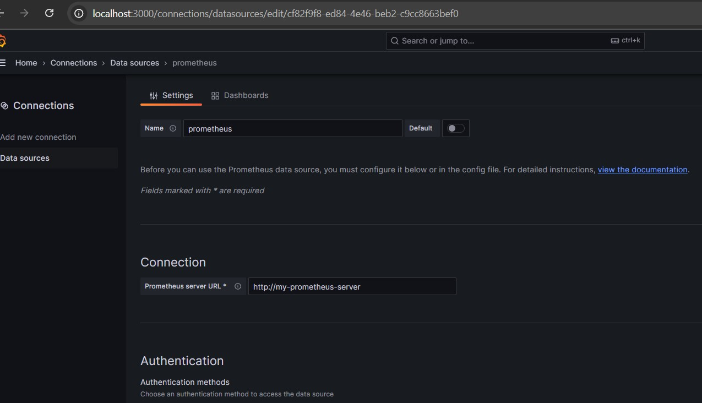

# Capacitación: Observabilidad y Logs en Kubernetes

## 📋 Agenda

1. Introducción a la Observabilidad
2. Arquitectura básica de Kubernetes
3. Instalación de entorno local (Minikube)
4. Despliegue del stack de logs (Loki, Promtail, Grafana)
5. Aplicación de demostración
6. Visualización de logs con `kubectl`
7. Exploración de logs en Grafana Loki
8. Breve vistazo a métricas y trazas
9. Buenas prácticas y conclusiones
10. Consultas promql
---

## 1. Introducción a la Observabilidad

### 1.1 ¿Qué es la observabilidad?

La **observabilidad** es la capacidad de entender el estado interno de un sistema complejo a partir de sus datos de salida:

* **Logs**: Eventos secuenciales que la aplicación escribe (errores, advertencias, información).
* **Métricas**: Valores numéricos en series de tiempo (CPU, memoria, latencia, tasa de errores).
* **Trazas**: El recorrido de una petición a través de múltiples servicios, con tiempos y dependencias.

> **Ventaja**: mientras el monitoreo tradicional alerta sobre fallos, la observabilidad te permite investigar la causa raíz.

---

## 2. Arquitectura básica de Kubernetes


### Componentes clave

| Componente                  | Tipo           | Descripción                                                 |
| --------------------------- | -------------- | ----------------------------------------------------------- |
| **Control Plane**           | Cerebro        | Decide qué ejecutar y gestiona el estado deseado.           |
| `kube-apiserver`            | API            | Recibe peticiones y las propaga al clúster.                 |
| `etcd`                      | Almacenamiento | Base distribuida con el estado del clúster.                 |
| `kube-scheduler`            | Scheduler      | Asigna Pods a nodos libres.                                 |
| `kube-controller-manager`   | Controller     | Mantiene el estado deseado (réplicas, endpoints, etc.).     |
| **Worker Node**             | Ejecutores     | Máquinas (reales o virtuales) que alojan Pods.              |
| `kubelet`                   | Agente         | Ejecuta y supervisa Pods en el nodo.                        |
| `kube-proxy`                | Red            | Gestiona el enrutamiento de red de los Pods.                |
| **Pod**                     | Unidad mínima  | Agrupa uno o más contenedores con ciclo de vida compartido. |
| **CRI (containerd/Docker)** | Runtime        | Ejecuta contenedores dentro de los Pods.                    |

---


### 3.1 Prerrequisitos

* Docker Desktop instalado
* Minikube,kind (última versión)
* Helm 3


## 4. Despliegue del stack de logs (Loki + Promtail + Grafana)

### 4.1 Añadir repositorio de Helm

```bash
helm repo add grafana https://grafana.github.io/helm-charts
helm repo update
```

### 4.2 Instalación con Helm

```bash
helm install loki grafana/loki-stack \
  --set promtail.enabled=true \
  --set grafana.enabled=true \
  --set loki.persistence.enabled=false
```

### 4.3 Credenciales de Grafana

```bash
# Extraer secret de Grafana\ Kubectl get secret loki-grafana -o jsonpath="{.data.admin-user}" | base64 -d
Kubectl get secret loki-grafana -o jsonpath="{.data.admin-password}" | base64 -d
```

* **Usuario**: `admin`
* **Clave**: la cadena decodificada del secret

### 4.4 Acceso a Grafana

```bash
kubectl port-forward svc/loki-grafana 3000:80
# Abrir en el navegador
http://localhost:3000
```

---

## 5. Aplicación de demostración

```bash
kubectl apply -f demo-logs-kubernetes.yaml
```

* Despliega un `Deployment` llamado `demo-nginx` que genera logs periódicos.
* Verifica los pods:

  ```bash
  kubectl get pods -l app=demo-nginx
  ```

---

## 6. Visualización rápida con `kubectl logs`

```bash
# Logs en vivo de todos los pods del deployment
docker kubectl logs -f deployment/demo-nginx

# Logs de un pod específico
kubectl logs -f pod/demo-nginx-xxxxx -c demo-nginx
```

---

## 7. Exploración de logs en Grafana (Loki)

1. En Grafana, ve a **Explore** → selecciona **Loki** como Data Source.
2. Query de ejemplo:

   ```logql
   {app="demo-nginx"}
   ```
3. Usa el panel **Fields** para ver histogramas de labels: `namespace`, `pod`, `container`, `node_name`.
4. Filtra haciendo clic en cualquier valor de label.

---

## 8. Ejemplos de registros, métricas y trazas

### 8.1 Ejemplo de log JSON

```json
{"timestamp":"2025-05-07T14:03:21Z","level":"ERROR","service":"demo-logs","pod":"demo-logs-xxxxx","message":"Error al procesar evento","error":"timeout"}
```

### 8.2 Ejemplo de métrica (Prometheus)

```promql
# HELP http_requests_total Total de peticiones HTTP
# TYPE http_requests_total counter
http_requests_total{handler="/api/demo"} 256
```

### 8.3 Ejemplo de traza (OpenTelemetry)

```go
ctx, span := tracer.Start(ctx, "ProcessDemo")
// ... lógica ...
dbCtx, dbSpan := tracer.Start(ctx, "MySQL:QueryDemo")
dbSpan.End()
span.End()
```

---

## 9. Buenas prácticas y conclusiones

* **Estandariza** tus logs (formato JSON, campos comunes).
* **Mantén** un esquema claro de labels en Promtail.
* **Asegura** tus endpoints de métricas y trazas.
* **Alertas** en Prometheus para picos de errores o latencias.
* **Correlación** logs ↔ métricas ↔ trazas mediante `trace_id`.


## 🔟 Instalación de Prometheus para recopilar métricas del clúster Kubernetes

Instala Prometheus usando Helm para comenzar a recopilar métricas del clúster, como uso de CPU, memoria y estado de los pods:

```bash
helm repo add prometheus-community https://prometheus-community.github.io/helm-charts
helm repo update

helm install my-prometheus prometheus-community/prometheus --version 27.12.1
```


consultas
```txt
memoria_total de nodo
node_memory_MemTotal_bytes{job="kubernetes-service-endpoints", node="minikube"} / (1024 * 1024 * 1024)

#memoria disponible
node_memory_MemAvailable_bytes{job="kubernetes-service-endpoints", node="minikube"} / (1024 * 1024 * 1024)

#cpu disponible del nodo kind
avg by (instance) (
  rate(node_cpu_seconds_total{mode="idle", node="minikube"}[5m])
) * 100


sum by (pod) (
  rate(container_cpu_usage_seconds_total{
    namespace="default",
    container!="POD"
  }[2m])
) / 1000
```


## 1. Memoria Total del Nodo (GB)
```promql
node_memory_MemTotal_bytes{job="kubernetes-service-endpoints", node="minikube"} / (1024 * 1024 * 1024)
```
## Métrica: Memoria Física Total del Nodo

### 📊 Métrica base
- **`node_memory_MemTotal_bytes`**  
  Muestra la **memoria física total** del nodo en **bytes**.

### 🔍 Filtros
- `job="kubernetes-service-endpoints"`: Solo considera métricas del servicio de endpoints de Kubernetes.
- `node=",kind"`: Filtra por el nodo llamado **kind**.

### 🔁 Conversión
- Se divide el valor por **1024³** para convertir de **bytes a gigabytes (GB)**.

### ✅ Resultado esperado
- Ejemplo:  
node_memory_MemTotal_bytes{...} 16.5


## Métrica: Memoria Disponible del Nodo

### 📊 Consulta
```prometheus
node_memory_MemAvailable_bytes{job="kubernetes-service-endpoints", node="minikube"} / (1024 * 1024 * 1024)
```

* Convierte la memoria disponible de **bytes a gigabytes (GB)**.

### 📌 Métrica usada

* **`node_memory_MemAvailable_bytes`**

### 🧠 Significado

* Representa la **memoria realmente disponible** para que las aplicaciones la usen.
* Incluye memoria libre + parte de caché/buffers que el sistema puede liberar fácilmente.
* Es **más precisa** que `MemFree` para conocer cuánta memoria puede usarse.

### 📍 Filtros

* `job="kubernetes-service-endpoints"`: Solo para métricas del servicio de endpoints de Kubernetes.
* `node="minikube"`: Aplica al nodo llamado **minikube**.

### ✅ Resultado esperado

* Muestra cuántos **GB de RAM están disponibles** para uso inmediato por aplicaciones.

### 🆚 Diferencia clave vs `node_memory_MemTotal_bytes`

| Métrica                          | ¿Qué mide?                                | Utilidad                     |
| -------------------------------- | ----------------------------------------- | ---------------------------- |
| `node_memory_MemTotal_bytes`     | Memoria física total del nodo             | Capacidad total del sistema  |
| `node_memory_MemAvailable_bytes` | Memoria utilizable sin afectar el sistema | Memoria realmente disponible |


## configuracion data source grafana

agregar en la url esto y guardar
http://my-prometheus-server




